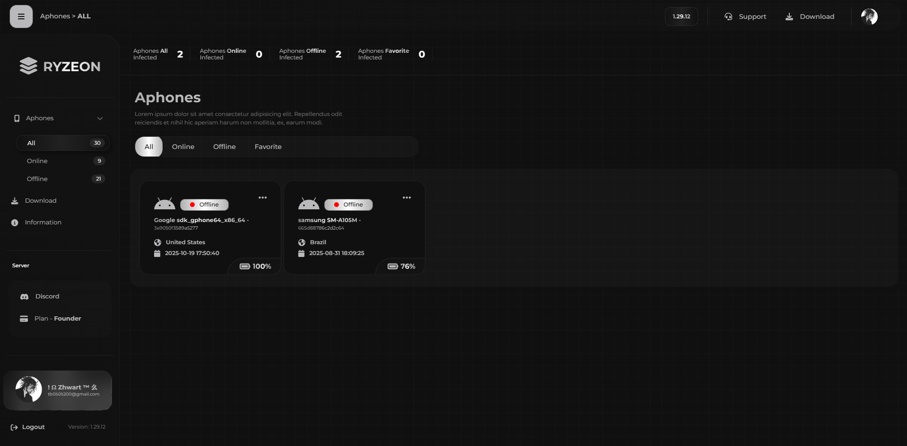
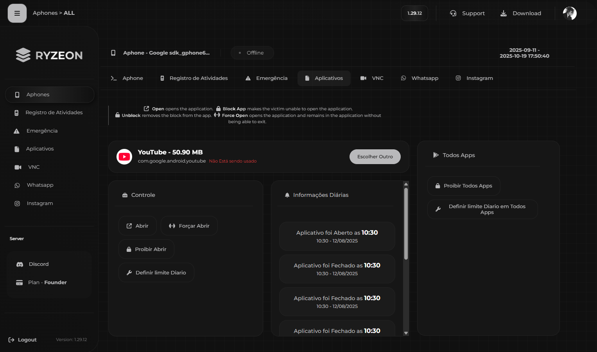
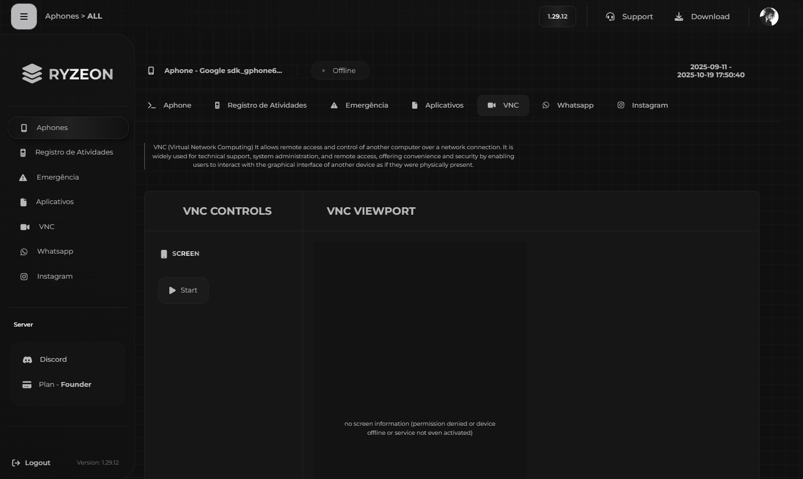

# SaaS Controle Parental

Plataforma de controle parental desenvolvida para monitoramento, gerenciamento de permissões, bloqueio de aplicativos e análise de uso em tempo real.
Projetada para alta escalabilidade, baixo consumo de recursos e integração multi-dispositivo.

---

## 🖼 Screenshots

<p float="left">    </p>
---

## Tecnologias
- React / React Native
- Node.js
- Firebase
- JWT/Auth
- Websocket
- SaaS Structure

---

## 📦 Instalação
```bash
git clone https://github.com/ZhawrtDev/Saas-Controle-Parental
cd Saas-Controle-Parental
npm install
npm start
